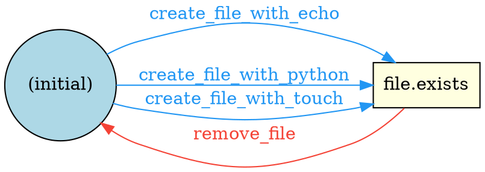
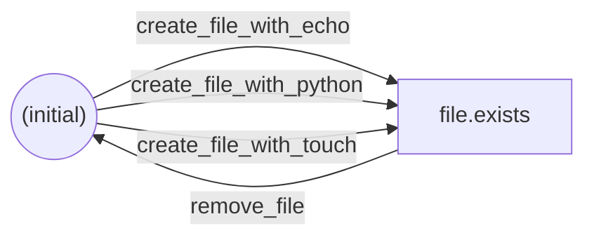

# Examples

## Parameter Support

TestWeaver offers two approaches for parameterized testing.

### Approach 1: Parameter Graph (`param_choices`)

Parameter values become states in the dependency graph. The graph engine naturally discovers all valid paths for each parameter combination. Use this when parameters change *which operations are available*.

```python
# vtpm_ops.py
from testweaver import action, check, provides, requires, excludes, when_param

@action
@when_param('tpm_backend', 'emulator')
@provides('swtpm_installed')
@excludes('swtpm_installed')
def install_swtpm(params):
    """Only runs when tpm_backend=emulator"""
    print("yum install swtpm swtpm-tools -y")

@action
@requires('vm.config')
@provides('vm.config.tpm')
def add_tpm(params):
    print(f"Adding TPM to {params.get('guest_name')}")

@check
@requires('vm.active.tpm')
def verify_tpm(params):
    print("Checking /dev/tpm0 inside guest")
```

```yaml
modules:
  - vtpm_ops.py

suite:
  name: vtpm
  targets: [verify_tpm]
  param_choices:
    - name: tpm_backend
      values: [emulator, passthrough]
```

The graph generates different test paths: emulator paths go through `install_swtpm`, passthrough paths skip it.

### Approach 2: Parameter Matrix (`param_matrix`)

Defines parameter axes and constraint rules. Generates the Cartesian product of values, filters invalid combinations, and runs each valid combination through the graph. Use this when parameters are *data values* that don't change graph structure.

```yaml
modules:
  - schedinfo_ops.py

suite:
  name: schedinfo
  targets: [check_cpu_shares]
  params:
    guest_name: testvm
  param_matrix:
    axes:
      - name: cpu_shares
        values: [512, 1024, 2048]
      - name: vcpu_count
        values: [1, 2, 4]
    constraints:
      - when: {cpu_shares: 2048, vcpu_count: 1}
        exclude: true
        reason: "Invalid combo: high shares with single vCPU"
```

You can also use the `@skip_when` decorator on operations:

```python
@action
@skip_when(vcpu_count=1)
@requires('vm.active')
@provides('vm.schedinfo.numa_balanced')
def enable_numa_balancing(params):
    """Skip for single-vCPU guests"""
    pass
```

### CLI Parameter Override

Override or add parameters from the command line:

```bash
testweaver run my_test.yaml -p guest_name=testvm -p timeout=60
testweaver matrix my_test.yaml --format text   # Preview parameter combinations
```

## Multi-Instance Namespaces

TestWeaver supports modeling multiple devices of the same type with independent states. This uses the `:` namespace separator and additive parameter choices.

### Basic Multi-Instance Setup

```python
# multi_tpm_ops.py
from testweaver import action, check, cleanup, provides, requires, clears

@action
@provides('vm.active.TPM:{tpm_id}.init')
def attach_tpm(params):
    """Attach a TPM device to the VM"""
    print(f"virsh attach-device {params.get('guest_name')} tpm-{params['tpm_id']}.xml")

@action
@requires('vm.active.TPM:{tpm_id}.init')
@provides('vm.active.TPM:{tpm_id}.ready')
def configure_tpm(params):
    """Configure the TPM device"""
    print(f"tpm2_startup -c on {params['tpm_id']}")

@check
@requires('vm.active.TPM:tpm*.ready')
def check_any_tpm_ready(params):
    """Verify at least one TPM is ready — uses wildcard to match any instance"""
    print("Checking TPM status in guest")

@cleanup
@requires('vm.active.TPM:{tpm_id}.init')
@clears('vm.active.TPM:{tpm_id}.init')
def detach_tpm(params):
    """Detach a TPM device"""
    print(f"virsh detach-device tpm-{params['tpm_id']}.xml")
```

```yaml
# multi_tpm_test.yaml
modules:
  - multi_tpm_ops.py

suite:
  name: "Multi-TPM Verification"
  targets: [check_any_tpm_ready]
  param_choices:
    - name: tpm_id
      values: [tpm0, tpm1]
      mode: additive
  cleanup: true
```

The `mode: additive` setting expands each templated operation into per-instance concrete operations (`attach_tpm[tpm_id=tpm0]`, `attach_tpm[tpm_id=tpm1]`). Unlike `exclusive` mode (the default), all instances coexist in the same graph — the engine explores paths where tpm0 and tpm1 are attached in different orders.

### Wildcard Queries

Use `*` in `requires` or `excludes` to query across instances:

```python
# Match ANY instance
@requires('vm.active.TPM:tpm*.ready')    # True if tpm0 OR tpm1 is ready

# Match a specific instance (no wildcard)
@requires('vm.active.TPM:tpm0.ready')    # True only if tpm0 is ready
```

Wildcards match per path segment using `fnmatch` — `TPM:tpm*` matches `TPM:tpm0`, `TPM:tpm1`, etc. The `*` does not cross `.` boundaries.

Wildcards are only allowed in read paths (`requires`, `excludes`). Write paths (`provides`, `clears`, `cuts`, `grafts`) must be deterministic — use `{param}` templates instead.

### Multiple Device Types

You can have multiple independent instance dimensions:

```python
@action
@provides('TPM:{tpm_id}.on')
def attach_tpm(params):
    pass

@action
@provides('DISK:{disk_id}.on')
def attach_disk(params):
    pass

@check
@requires('TPM:tpm*.on', 'DISK:disk*.on')
def check_devices(params):
    """Requires at least one TPM and one disk to be attached"""
    pass
```

```yaml
suite:
  name: "Multi-Device"
  targets: [check_devices]
  param_choices:
    - name: tpm_id
      values: [tpm0, tpm1]
      mode: additive
    - name: disk_id
      values: [disk0, disk1]
      mode: additive
```

### Generation Strategies

Multi-instance expansion can produce many test cases. Use `generation_strategy` to control this:

```yaml
suite:
  name: "Multi-Device Test"
  targets: [check_devices]
  generation_strategy: pairwise
  param_choices:
    - name: tpm_id
      values: [tpm0, tpm1]
      mode: additive
    - name: disk_id
      values: [disk0, disk1]
      mode: additive
```

| Strategy | Behavior | Best For |
|----------|----------|----------|
| `exhaustive` | (Default) All valid test paths | Small instance counts, critical path testing |
| `pairwise` | Minimum subset covering all pairs of instance operations | Multiple device types, compatibility verification |
| `representative` | One case per unique step-sequence shape | Verifying system behavior where the specific device ID is irrelevant |

### Mixing Additive and Exclusive Choices

You can combine additive instances with exclusive parameter choices:

```yaml
suite:
  name: "TPM with Backend Variants"
  targets: [verify_tpm]
  param_choices:
    - name: tpm_backend
      values: [emulator, passthrough]
      mode: exclusive
    - name: tpm_id
      values: [tpm0, tpm1]
      mode: additive
```

This generates separate test paths for each backend (emulator vs passthrough), with both TPM instances available in each path.

## Operation Verification

Attach verify callbacks to operations so that verification runs automatically after each successful step. This is cleaner than making verifications separate graph nodes — verify functions don't change state, so they shouldn't participate in path-finding.

### Python: `@verify_for`

```python
from testweaver import action, cleanup, provides, requires, clears, verify_for

@action
@provides('rng.present')
def add_rng(params):
    """Attach RNG device to VM"""
    print(f"virsh attach-device {params.get('guest_name')} rng.xml")

@verify_for('add_rng')
def verify_rng_in_vm(params):
    """Verify RNG device is visible inside the VM"""
    print(f"ssh {params.get('guest_name')} ls /dev/hwrng")

@action
@requires('rng.present')
@clears('rng.present')
def remove_rng(params):
    """Detach RNG device from VM"""
    print(f"virsh detach-device {params.get('guest_name')} rng.xml")

@verify_for('remove_rng')
def verify_no_rng_in_vm(params):
    """Verify RNG device is no longer visible inside the VM"""
    import subprocess
    result = subprocess.run(
        f"ssh {params.get('guest_name')} test ! -e /dev/hwrng",
        shell=True,
    )
    if result.returncode != 0:
        raise AssertionError("RNG device still present after removal")
```

When `add_rng` runs and passes, `verify_rng_in_vm` runs automatically. When `remove_rng` runs and passes, `verify_no_rng_in_vm` runs automatically. No multi-target chaining needed.

### YAML: `verify` field

```yaml
operations:
  - name: add_rng
    type: action
    provides: [rng.present]
    run: virsh attach-device $guest_name rng.xml
    verify: ssh $guest_name ls /dev/hwrng

  - name: remove_rng
    type: action
    requires: [rng.present]
    clears: [rng.present]
    run: virsh detach-device $guest_name rng.xml
    verify: ssh $guest_name test ! -e /dev/hwrng
```

### Verify vs Check vs TransitionObserver

| Mechanism | When it runs | Graph impact | Lifetime |
|-----------|-------------|--------------|----------|
| `verify` / `@verify_for` | After its attached operation | None | Per operation |
| `@check` target | End of test case (as a target) | Target node | Once per case |
| `TransitionObserver` | After any watched operation | None | Rest of case |

Use `verify` when you want to validate that a specific operation did its job. Use `@check` when you want a standalone verification target. Use `TransitionObserver` when you need ongoing monitoring across multiple operations.

## Graph Modifiers

In real test environments, a step's execution can change what future steps are valid. For example, disabling hugepages makes VM start impossible, or setting memory tuning requires a libvirtd restart before the next operation. The static dependency graph can't model these runtime decisions.

Graph modifiers let callable operations return objects that influence execution flow. The runner processes them during case execution — no changes to the graph engine or case generation are needed.

### EdgeGuard

Blocks a future operation, forcing the runner to find an alternative path through the dependency graph (replanning). Use when a step discovers that a later step is now invalid.

```python
from testweaver import action, provides, excludes, EdgeGuard

@action
@provides('hugepage_config')
@excludes('hugepage_config')
def configure_hugepages(params):
    mount = params.get('hugetlbfs_mount', '/dev/hugepages')
    if mount == '':
        # Hugepages disabled — VM start will fail
        return EdgeGuard(
            blocked_op='start_vm',
            reason='hugepages disabled by empty mount path',
        )
```

When the runner encounters a blocked operation in the remaining steps, it queries the dependency graph for an alternative path that avoids the blocked operation. If no alternative exists, the case ends with an error. The `CaseResult` includes `replanned=True` and `replan_reason` when replanning occurs.

Replanning requires the graph to be passed to `run_case` / `run_all`:

```python
from testweaver.graph import build_graph, generate_cases
from testweaver.engine import run_all

graph = build_graph(definition.operations)
cases = generate_cases(definition, graph)
results, suite_hooks = run_all(cases, definition, graph=graph)
```

### TransientHook

Injects a one-shot step before a future operation. The hook fires once and is automatically removed. Use for temporary obligations like "restart a service before the next matching operation".

```python
from testweaver import action, provides, requires, TransientHook

@action
@requires('vm.active')
@provides('vm.active.memtune')
def set_memtune(params):
    limit = params.get('hard_limit', 1048576)
    print(f"virsh memtune --hard-limit {limit}")

    if params.get('restart_libvirtd'):
        def restart(p):
            print("systemctl restart libvirtd")

        return TransientHook(
            before_op='check_memtune',
            action=restart,
            name='restart_libvirtd',
            reason='libvirtd restart required after memtune',
        )
```

The injected step appears in `CaseResult.steps` with `injected=True`.

### TransitionObserver

Registers a persistent verification callback that runs after every execution of a watched operation, for the remainder of the case. Does not affect graph validity or case generation.

```python
from testweaver import action, provides, requires, TransitionObserver

@action
@requires('vm.active')
@provides('vm.active.memdevice')
def attach_mem_device(params):
    print("virsh attach-device mem.xml")

    def check_audit(p):
        print("ausearch -m VIRT_RESOURCE -ts recent")

    return TransitionObserver(
        watch_ops=['attach_mem_device', 'detach_mem_device'],
        verify=check_audit,
        name='audit_log_check',
        reason='verify audit trail after memory device changes',
    )
```

Observer results are attached to the corresponding `StepResult.observer_results` list. If the verify callable raises an exception, the case is marked as failed.

### Modifier Summary

| Modifier | Purpose | Lifetime | Affects graph? |
|----------|---------|----------|----------------|
| `EdgeGuard` | Block a future operation, trigger replan | Rest of case | Yes (replan) |
| `TransientHook` | Inject a step before a future operation | One-shot | No |
| `TransitionObserver` | Verify after matching operations | Rest of case | No |

### Full Example

See `examples/modifiers_demo.py` and `examples/modifiers_demo.yaml` for a complete working example that demonstrates all three modifier types in a VM testing scenario.

```bash
# Normal run — all 60 cases pass
testweaver run examples/modifiers_demo.yaml --format text

# With hugepages disabled — EdgeGuard triggers replanning
testweaver run examples/modifiers_demo.yaml -p hugetlbfs_mount= --format text
```

## Graph Visualization

Export the dependency graph in DOT or Mermaid format for visual debugging.

### DOT (Graphviz)

```bash
testweaver graph examples/demo_file_ops.py --format dot
```

Output:



Render with Graphviz:

```bash
testweaver graph examples/demo_file_ops.py --format dot | dot -Tpng -o graph.png
testweaver graph examples/demo_file_ops.py --format dot -o graph.dot  # Save to file
```

### Mermaid

```bash
testweaver graph examples/demo_file_ops.py --format mermaid
```

Output:



Paste into GitHub markdown, Mermaid Live Editor, or any compatible renderer.

### Node and Edge Styling

Nodes are styled by role:

| Node Type | DOT Shape | Color |
|-----------|-----------|-------|
| Initial state | Circle | Light blue |
| Dead-end state | Octagon | Light salmon |
| Normal state | Box | Light yellow |

Edges are colored by operation type:

| Operation Type | Color |
|----------------|-------|
| Action | Blue (`#2196F3`) |
| Setup | Green (`#4CAF50`) |
| Cleanup | Red (`#F44336`) |
| Fault | Orange (`#FF9800`) |

## Test Case Filtering

After generating test cases, use filtering options to run a specific subset. Available on both `generate` and `run`.

### Filter by Case ID

Use `-k` with fnmatch glob patterns to match case IDs:

```bash
# Run only cases whose ID starts with "check-"
testweaver run my_test.yaml -k "check-*"

# Multiple patterns — matches any (OR)
testweaver run my_test.yaml -k "check-1" -k "verify-*"

# Preview which cases match
testweaver generate my_test.yaml -k "fault-*" --format text
```

### Filter by Target Operation

Use `-t` / `--target` to keep only cases for specific targets:

```bash
testweaver run examples/virt/vtpm_test.yaml -t verify_tpm
testweaver generate my_test.yaml -t check_file_exists -t check_permissions
```

### Filter by Step Presence

Use `--has-step` to keep cases that include a specific operation in their step sequence:

```bash
# Only cases that go through install_swtpm
testweaver run examples/virt/vtpm_test.yaml --has-step install_swtpm
```

### Filter Fault Cases

```bash
# Only fault-injection cases
testweaver run my_test.yaml --fault-only

# Exclude fault-injection cases
testweaver run my_test.yaml --no-fault
```

### Combining Filters

All filter types are AND-combined. Within each repeatable option, matching is OR:

```bash
# check-* cases that are NOT faults
testweaver run my_test.yaml -k "check-*" --no-fault

# Cases targeting verify_tpm that contain the install_swtpm step
testweaver run examples/virt/vtpm_test.yaml -t verify_tpm --has-step install_swtpm
```

### Programmatic API

```python
from testweaver.filtering import filter_cases
from testweaver.graph import generate_cases

cases = generate_cases(definition)

# Filter by ID pattern
subset = filter_cases(cases, ids=["check-*"])

# Filter by target and exclude faults
subset = filter_cases(cases, targets=["verify_tpm"], no_fault=True)

# Filter by parameter values
subset = filter_cases(cases, params={"tpm_backend": "emulator"})

# Combine multiple criteria (AND)
subset = filter_cases(
    cases,
    ids=["check-*"],
    steps=["install_swtpm"],
    no_fault=True,
)
```

## Structured Reporting

TestWeaver can output test results in multiple formats for different consumers.

### JUnit XML

JUnit XML is the standard format for CI/CD test result integration. Jenkins, GitHub Actions, and GitLab CI all parse it natively.

```bash
testweaver run my_test.yaml --format junit -o results.xml
```

Output structure:

```xml
<?xml version="1.0" ?>
<testsuites>
  <testsuite name="Hello World" tests="3" failures="1" errors="0"
             time="1.234" timestamp="2026-05-14T10:30:00+00:00" hostname="ci-node">
    <testcase name="check_file_exists-1" classname="Hello World" time="0.150"/>
    <testcase name="check_file_exists-2" classname="Hello World" time="0.200">
      <failure type="TestFailure" message="create_file failed">
        /tmp/hello.txt: Permission denied
      </failure>
      <system-err>/tmp/hello.txt: Permission denied</system-err>
    </testcase>
    <testcase name="check_file_exists-3" classname="Hello World" time="0.010">
      <system-out>hello world</system-out>
    </testcase>
  </testsuite>
</testsuites>
```

Key attributes for CI tools:
- `classname` — required by GitLab CI for proper grouping
- `time` — duration in seconds (converted from TestWeaver's milliseconds)
- `<failure>` vs `<error>` — assertion failures vs unexpected errors
- `<system-out>` / `<system-err>` — captured step output

#### GitHub Actions Integration

```yaml
# .github/workflows/test.yml
- name: Run tests
  run: testweaver run my_test.yaml --format junit -o results.xml

- name: Publish test results
  uses: dorny/test-reporter@v1
  if: always()
  with:
    name: TestWeaver Results
    path: results.xml
    reporter: java-junit
```

#### GitLab CI Integration

```yaml
# .gitlab-ci.yml
test:
  script:
    - testweaver run my_test.yaml --format junit -o results.xml
  artifacts:
    reports:
      junit: results.xml
```

### TAP (Test Anything Protocol)

TAP version 13 is a text-based streaming format. Each test result is printed as it completes, making it ideal for live monitoring.

```bash
testweaver run my_test.yaml --format tap
```

Output:

```
TAP version 13
1..3
ok 1 - check_file_exists-1 (150ms)
not ok 2 - check_file_exists-2 (200ms)
  ---
  message: 'create_file failed'
  severity: fail
  at:
    step: 'create_file'
  stderr: '/tmp/hello.txt: Permission denied'
  ...
ok 3 - check_file_exists-3 (10ms)
# total: 3
# passed: 2
# failed: 1
```

Fault-injection cases are tagged with a `# FAULT` directive:

```
not ok 4 - fault-create_file-1 (50ms) # FAULT
```

### HTML

A self-contained HTML page with inline CSS — no external dependencies, viewable in any browser.

```bash
testweaver run my_test.yaml --format html -o report.html
```

The report includes:
- Summary header with pass/fail/error counts and total duration
- Color-coded status badges (green/red/orange)
- Fault-injection badges for fault cases
- Expandable step-by-step details per case with stdout/stderr output

### Programmatic API

All formatters accept `list[CaseResult]` and `RunSummary`:

```python
from testweaver.engine import run_all
from testweaver.analyzer import summarize_run
from testweaver.reporters import to_junit_xml, to_tap, to_html

results, suite_hooks = run_all(cases, definition)
summary = summarize_run(results, suite_hook_results=suite_hooks)

# Generate reports
junit_xml = to_junit_xml(results, summary, suite_name="My Suite")
tap_output = to_tap(results, summary)
html_report = to_html(results, summary)

# Write to files
Path("results.xml").write_text(junit_xml)
Path("report.html").write_text(html_report)
```

## Retry / Flaky Test Handling

Infrastructure tests frequently fail due to transient issues — network timeouts, VM boot delays, service restarts. TestWeaver retries failed cases automatically and flags flaky tests.

### Basic Usage

```bash
# Retry failed cases up to 3 times
testweaver run my_test.yaml --retries 3

# Add a delay between retries (useful when waiting for resources to recover)
testweaver run my_test.yaml --retries 2 --retry-delay 10

# Combine with parallel execution
testweaver run my_test.yaml --retries 2 --retry-delay 5 -w 4
```

### How Retries Work

When a test case fails (status `"fail"` or `"error"`) and `--retries` is greater than 0:

1. The failed attempt is recorded (including all steps and cleanup)
2. TestWeaver waits `--retry-delay` seconds (if set)
3. The entire case runs again from scratch — fresh setup, steps, and cleanup
4. If the case passes, it's marked as **flaky** and execution continues
5. If it fails again, repeat until retries are exhausted

Each attempt is independent — cleanup runs at the end of every attempt, and the next attempt starts from a clean state. This is critical for infrastructure testing where a failed VM start needs cleanup before retry.

### Flaky Detection

A test case is marked as **flaky** when:
- It ultimately passes (`status == "pass"`)
- But at least one earlier attempt failed

Flaky cases are a signal that the test or the system under test has intermittent issues. The `CaseResult` carries both the final (passing) result and the full history:

```python
result = run_case_with_retries(case, definition, retries=2)

if result.flaky:
    print(f"Case {result.case_id} is flaky!")
    print(f"  Final status: {result.status}")
    print(f"  Retries needed: {result.retry_count}")
    for att in result.attempts:
        print(f"  Attempt {att.attempt}: {att.status} ({att.duration_ms:.0f}ms)")
```

### Report Output with Retries

#### Text Format

```
Total: 4  Passed: 3  Failed: 1  Errors: 0
Retried: 2
Flaky: 1
Duration: 5200ms
  [PASS] check-1 (150ms)
  [PASS] check-2 [FLAKY] (retried 1x) (800ms)
  [FAIL] check-3 (retried 2x) (1500ms)
  [PASS] check-4 (100ms)
```

#### JUnit XML

Flaky cases include `<flakyFailure>` elements (Jenkins convention) and `<properties>` with retry metadata:

```xml
<testcase name="check-2" classname="MyTest" time="0.800">
  <properties>
    <property name="retry_count" value="1"/>
    <property name="flaky" value="true"/>
  </properties>
  <flakyFailure type="Attempt1" message="network timeout">
    Connection refused: 192.168.1.100:22
  </flakyFailure>
</testcase>
```

#### TAP

```
ok 2 - check-2 (800ms) # FLAKY
  ---
  retry_count: 1
  flaky: true
  ...
# retried: 2
# flaky: 1
```

#### HTML

The HTML report shows:
- A **FLAKY** badge (yellow) next to the status
- A **Flaky** count in the summary stats
- A collapsible **"Show retry attempts"** section with per-attempt step details and status badges

### Programmatic API

```python
from testweaver.engine import run_all, run_case_with_retries
from testweaver.analyzer import summarize_run

# Run all cases with retries
results, suite_hooks = run_all(cases, definition, retries=3, retry_delay=2.0, workers=4)
summary = summarize_run(results, suite_hook_results=suite_hooks)

print(f"Flaky cases: {summary.flaky}")
print(f"Cases retried: {summary.retried}")

# Filter flaky results
flaky_cases = [r for r in results if r.flaky]
for r in flaky_cases:
    print(f"  {r.case_id}: passed after {r.retry_count} retry(s)")

# Access attempt history
for r in results:
    if r.attempts:
        for att in r.attempts:
            print(f"  Attempt {att.attempt}: {att.status} ({att.duration_ms:.0f}ms)")
            for step in att.steps:
                print(f"    {step.operation}: {step.status}")
```

### CaseResult Fields

| Field | Type | Description |
|-------|------|-------------|
| `retry_count` | `int` | Number of retries performed (0 = ran once, no retries) |
| `flaky` | `bool` | `True` if the case ultimately passed but failed on earlier attempt(s) |
| `attempts` | `list[AttemptResult]` | All attempt results (only populated when `retry_count > 0`) |

Each `AttemptResult` contains:

| Field | Type | Description |
|-------|------|-------------|
| `attempt` | `int` | 1-indexed attempt number |
| `steps` | `list[StepResult]` | Steps executed in this attempt |
| `status` | `str` | `"pass"`, `"fail"`, or `"error"` |
| `duration_ms` | `float` | Duration of this attempt |

## Logging

TestWeaver uses Python's standard `logging` module throughout the engine, graph builder, definition loader, and CLI. By default, logging is silent (WARNING level). Use CLI flags to enable execution tracing.

### Basic Usage

```bash
# Show case and step lifecycle events
testweaver run my_test.yaml -v

# Show everything: commands, return codes, modifiers, env state
testweaver run my_test.yaml --debug

# Write logs to a file while also printing to stderr
testweaver run my_test.yaml -v --log-file execution.log

# Debug graph building and case generation
testweaver generate my_test.yaml -v
testweaver graph my_test.yaml --debug
```

### Log Levels

| Level | Typical output |
|-------|---------------|
| WARNING (default) | Only timeouts and unexpected errors |
| INFO (`-v`) | `Case started: check-1`, `Step finished: setup status=pass (12ms)`, `Graph built: 5 nodes, 8 edges`, `Generated 3 test case(s)` |
| DEBUG (`--debug`) | `Executing command: echo hello (timeout=300s)`, `Command exit code: 0`, `Operation 'start_vm' is blocked by edge guard`, `Replanned around 'start_vm': new path [...]`, `Firing transient hook before 'check_memtune'` |

### Parallel Execution Logs

When running with multiple workers (`-w N`), log lines include the thread name so you can trace which worker is executing each case:

```bash
testweaver run my_test.yaml -v -w 4
```

```
2026-05-14 10:30:00,123 INFO  [testweaver.engine] [Thread-1] Case started: check-1 (target=check, steps=3)
2026-05-14 10:30:00,124 INFO  [testweaver.engine] [Thread-2] Case started: check-2 (target=check, steps=3)
2026-05-14 10:30:00,200 INFO  [testweaver.engine] [Thread-1] Step finished: setup status=pass (75ms)
```

### Programmatic Configuration

For programmatic use, configure the `testweaver` logger directly:

```python
import logging
from testweaver.engine import run_all
from testweaver.graph import build_graph, generate_cases

# Enable INFO-level logging to stderr
tw_logger = logging.getLogger("testweaver")
tw_logger.setLevel(logging.INFO)
tw_logger.addHandler(logging.StreamHandler())

# All modules (engine, graph, schema, loader) now emit logs
graph = build_graph(definition.operations)
cases = generate_cases(definition, graph)
results, suite_hooks = run_all(cases, definition, graph=graph)

# For fine-grained control, configure per-module loggers
logging.getLogger("testweaver.engine").setLevel(logging.DEBUG)
logging.getLogger("testweaver.graph").setLevel(logging.WARNING)
```

## Lifecycle Hooks

Lifecycle hooks run at fixed points in the test execution, outside the dependency graph. They're ideal for environment provisioning, log collection, state snapshots, and cleanup tasks that don't participate in case generation.

### Suite-Level Hooks

`@suite_setup` runs once before any test case. `@suite_teardown` runs once after all cases finish, even if suite setup or cases fail.

```python
from testweaver import suite_setup, suite_teardown

@suite_setup
def provision_vms(context):
    """Start the test VM pool."""
    print(f"Provisioning VMs for suite: {context['_suite_name']}")
    print(f"Will run {context['_case_count']} test cases")

@suite_teardown
def collect_logs(context):
    """Gather all VM logs — runs even if suite setup failed."""
    if context.get('_suite_setup_failed'):
        print("Suite setup failed, collecting diagnostic logs")
    else:
        print("Collecting final test logs")
```

Suite hooks receive a context dict containing all suite-level params plus:

| Key | Type | Description |
|-----|------|-------------|
| `_suite_name` | `str` | Name of the test suite |
| `_case_count` | `int` | Number of cases to run |
| `_suite_setup_failed` | `bool` | (teardown only) Whether suite setup failed |

### Case-Level Hooks

`@case_setup` runs before each test case. `@case_teardown` runs after each case, even on failure.

```python
from testweaver import case_setup, case_teardown

@case_setup
def snapshot_vm(context):
    """Take a VM snapshot before each test case."""
    case_id = context['_case_id']
    print(f"Creating snapshot for case: {case_id}")

@case_teardown
def restore_and_log(context):
    """Restore VM state and collect logs after each case."""
    status = context.get('_status', 'unknown')
    case_id = context['_case_id']
    print(f"Case {case_id} finished with status: {status}")
    if status != "pass":
        print(f"Collecting failure logs for {case_id}")
```

Case hooks receive a context dict containing case-level params plus:

| Key | Type | Description |
|-----|------|-------------|
| `_case` | `TestCase` | The test case object |
| `_case_id` | `str` | Case identifier |
| `_status` | `str` | (teardown only) Case status before teardown |

### Multiple Hooks

You can define multiple hooks of the same type. They run in definition order, and a failure in one does not prevent others from running:

```python
@case_teardown
def save_vm_logs(context):
    print("Saving VM logs...")

@case_teardown
def save_network_logs(context):
    print("Saving network logs...")

@case_teardown
def reset_firewall(context):
    print("Resetting firewall rules...")
```

### Error Semantics

| Scenario | Behavior |
|----------|----------|
| Suite setup fails | All cases skipped (status=error); suite teardown still runs |
| Case setup fails | Main steps skipped; cleanup and case teardown still run |
| Teardown fails | Recorded in results but doesn't change case/suite status |
| One hook of N fails | Remaining hooks still run |

### Programmatic API

```python
from testweaver.engine import run_all, run_case
from testweaver.schema import LifecycleHooks

# Hooks can be set programmatically
hooks = LifecycleHooks(
    suite_setup=[my_setup_fn],
    suite_teardown=[my_teardown_fn],
    case_setup=[my_case_setup],
    case_teardown=[my_case_teardown],
)
definition.hooks = hooks

# run_all returns (case_results, suite_hook_results)
results, suite_hooks = run_all(cases, definition, workers=4)

# Suite hook results
for hr in suite_hooks:
    print(f"Suite hook: {hr.hook_name} ({hr.hook_type}): {hr.status}")

# Case hook results are per-case
for r in results:
    for hr in r.hook_results:
        print(f"  {hr.hook_type}: {hr.hook_name} -> {hr.status}")
        if hr.error:
            print(f"    Error: {hr.error}")
```

### HookResult Fields

| Field | Type | Description |
|-------|------|-------------|
| `hook_name` | `str` | Function name |
| `hook_type` | `str` | One of `suite_setup`, `suite_teardown`, `case_setup`, `case_teardown` |
| `status` | `str` | `"pass"` or `"error"` |
| `error` | `str \| None` | Error message on failure |
| `duration_ms` | `float` | Execution time in milliseconds |

## Virtualization Examples

The `examples/virt/` directory contains mock implementations of libvirt/QEMU test operations, ported from depend-test-framework:

| Module | Operations | Description |
|--------|-----------|-------------|
| `vm_basic.py` | 4 | Guest lifecycle: define, start, destroy, undefine |
| `vtpm.py` | 11 | vTPM device management with param_choices (emulator vs passthrough) |
| `save_restore.py` | 8 | Save/restore using graft+cut migrate pattern |
| `vdisk.py` | 2 | Virtual disk attach and verify |
| `multi_disk.py` | 8 | Multi-disk hot-plug with additive namespaces and wildcard queries |
| `backing_chain.py` | 5 | Snapshot management with block pull/commit |
| `schedinfo.py` | 7 | CPU scheduling parameters |
| `numa.py` | 1 | NUMA topology configuration |
| `mem_device.py` | 4 | Memory hotplug |

Try them:

```bash
testweaver generate examples/virt/vdisk_test.yaml --format text
testweaver run examples/virt/backing_chain_test.yaml --format text
testweaver graph examples/virt/save_restore_test.yaml --format text
testweaver graph examples/virt/save_restore_test.yaml --format dot -o save_restore.dot

# Parameter graph: emulator vs passthrough generate different test paths
testweaver generate examples/virt/vtpm_test.yaml --format text

# Parameter matrix: test cpu_shares with 3 values
testweaver generate examples/virt/schedinfo_test.yaml --format text
testweaver matrix examples/virt/schedinfo_test.yaml --format text

# Multi-instance: additive disk namespaces with wildcard queries
testweaver generate examples/virt/multi_disk_test.yaml --format text
testweaver run examples/virt/multi_disk_test.yaml --format text
```
