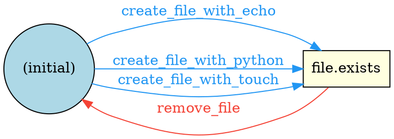
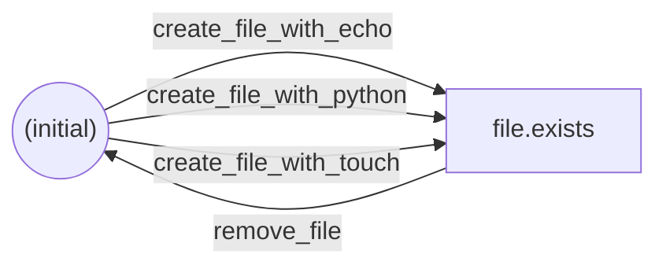

# Graph Visualization

Export the dependency graph in DOT or Mermaid format for visual debugging.

## DOT (Graphviz)

```bash
testweaver graph examples/demo_file_ops.py --format dot
```

Output:



Render with Graphviz:

```bash
testweaver graph examples/demo_file_ops.py --format dot | dot -Tpng -o graph.png
testweaver graph examples/demo_file_ops.py --format dot -o graph.dot  # Save to file
```

## Mermaid

```bash
testweaver graph examples/demo_file_ops.py --format mermaid
```

Output:



Paste into GitHub markdown, Mermaid Live Editor, or any compatible renderer.

## Node and Edge Styling

Nodes are styled by role:

| Node Type | DOT Shape | Color |
|-----------|-----------|-------|
| Initial state | Circle | Light blue |
| Dead-end state | Octagon | Light salmon |
| Normal state | Box | Light yellow |

Edges are colored by operation type:

| Operation Type | Color |
|----------------|-------|
| Action | Blue (`#2196F3`) |
| Setup | Green (`#4CAF50`) |
| Cleanup | Red (`#F44336`) |
| Fault | Orange (`#FF9800`) |
